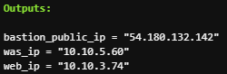

# Module 설명

## 구성요소 
### main.tf
- 사용자가 생성할 리소스에 대한 정보가 담겨져 있는 파일

### variables.tf(필수 아님)
- main.tf에 사용할 리소스에 대한 정보를 var 변수로 처리해 주는 파일

### output.tf(필수 아님)
- 사용자가 생성한 리소스의 모듈의 값을 도출하여 다른 모듈에서 사용하게 해주는 파일

## VPC
- 필수 : name, cidr, az, subnets

### main.tf
- vpc_cidr : 사용자가 원하는 cidr 범위 설정 가능
- az : 가용 영역의 종류나 갯수
- public_subnets : 퍼블릭 범위나 갯수 -> 현재 2개
- private_subnets : 프라이빗 범위나 갯수 -> 현재 6개
- nat_gateway : 기본값은 true

    enable_nat_gateway : nat_gateway를 사용 할 것인지?

    single_nat_gateway : nat_gateway를 1개 사용할 것인지?

    one_nat_gateway_per_az : 가용영역 당 nat_gateway를 사용할 것인지?

### variables.tf
- vpc_cidr : vpc 범위 -> 10.10.0.0/20
- availability_zone : 가용 영역 -> ap-northeast-2a, ap-northeast-2c 
- public_subnets : 퍼블릭 서브넷 영역
- private_subnet : 프라이빗 서브넷 영역

### outputs.tf
- vpc_id : 다른 모듈에서 vpc를 사용할때 (ex. alb 생성, rds 생성) 
- public_subnets : 다른 모듈에서 퍼브릭 서브넷을 필요로 할때 (ex. alb 생성, rds 생성)
- private_subnets : 다른 모듈에서 프라이빗 서브넷을 필요로 할때 (ex. alb 생성, rds 생성)

## Security Group
- 필수 : vpc, ingress, egress ,cider blocks

### main.tf
- vpc_id : 생성할 보안그룹이 속할 vpc
- ingress & egress

    인바운드 & 아웃바운드 : 사용할 포트와 프로토콜을 지정할 수 있음(프로토콜 -1은 모든 트래픽)
    
    cider_blocks : 어떤 ip를 소스를 넣어줄 것인지 설정 가능

    security_groups : ip뿐만 아니라 생성한 보안그룹을 소스로 설정 가능

### variables.tf
- vpc_id : vpc 모듈에서 도출한 vpc 값
- web_ip & web1_ip : ec2 모듈에서 도출한 ec2 값으로, WAS 보안그룹 생성할때 사용

### outputs.tf
- sg_id : 각각의 보안그룹의 id로 ec2를 생성할때 해당 보안그룹을 사용하거나, alb나 rds 등 다른 리소르르 생성할때 필요한 보안그룹  

## EC2
- 필수 : name, instance type, key, security group, subnet 

### main.tf
- ami : ec2의 이미지 
- instance type : ec2의 타입 크기
- key name : ec2에 접속할 키 페어 이름
- vpc_security_group_ids : ec2와 연결한 보안그룹
- associate_public_ip_address : 퍼블릭 자동 할당, 기본값은 false
- subnet_id : 어떤 서브넷에 설치할 것인지
- user_data : 기본값은 false, 고급 세부 정보의 사용자 데이터의 내용 

### variables.tf
- ami_id : 현재 사용하고 있는 이미지 -> ami-00ff737803101edd1 : aml-2023, AMI 카탈로그에서 검색 가능
- instance_type : 사용하고 싶은 타입 설정 가능
- key_name : ssh-keygen을 통해서 생성한 키페어 
- sg_id : sg(보안그룹)의 모듈의 output을 통해서 var 변수로 참조 가능

### outputs.tf
- public_ip : 메인 디렉토리의 outputs.tf에서 참조할 값
- web_ip : 보안그룹 생성할때 ip를 넣어주기 위한 값
- was_ip : 메인 디렉토리의 outputs.tf에서 참조할 값
- instance_id : alb나 nlb의 대상그룹에 참조 가능
